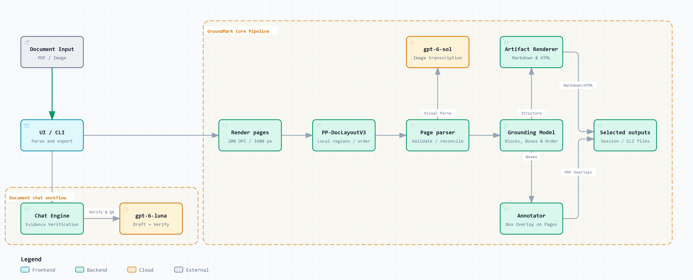
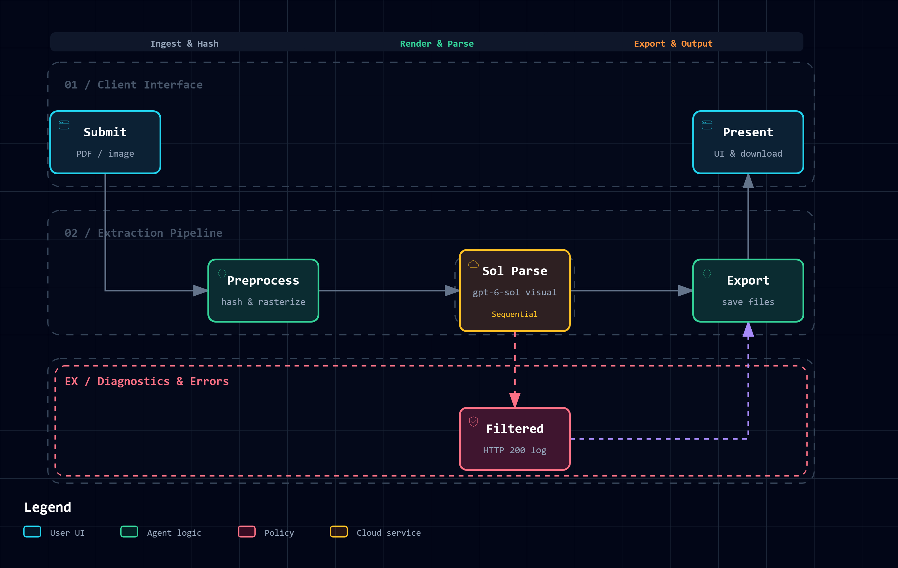
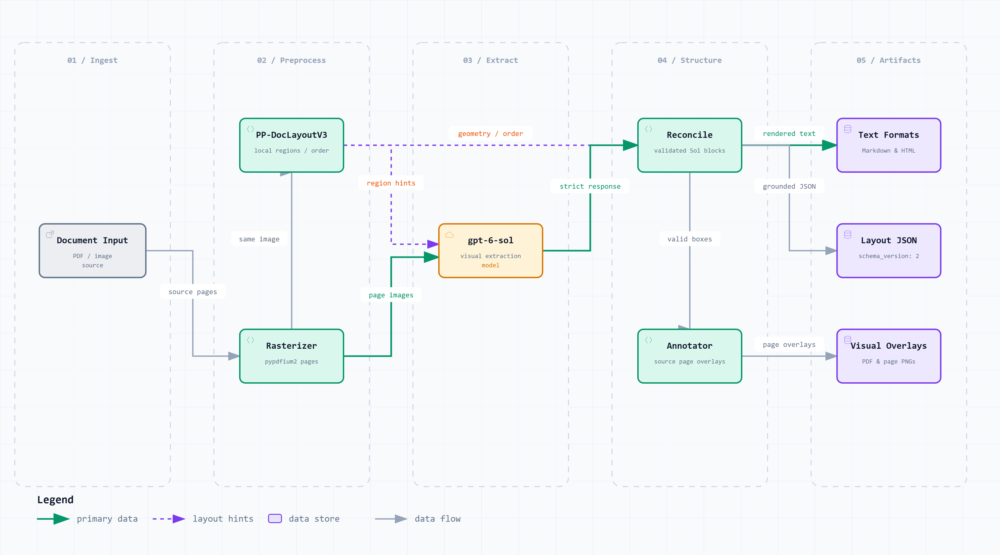
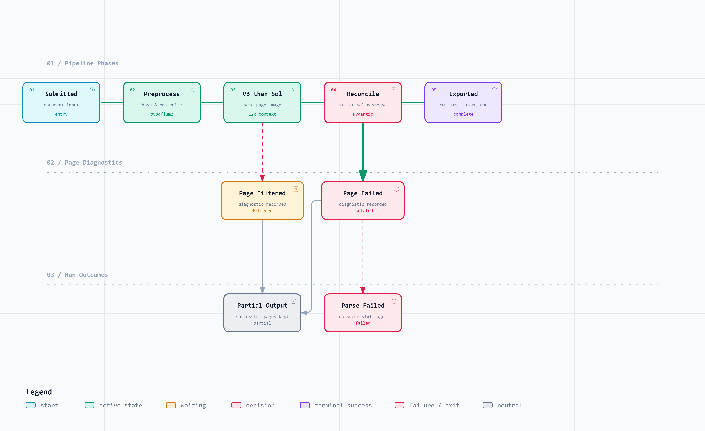
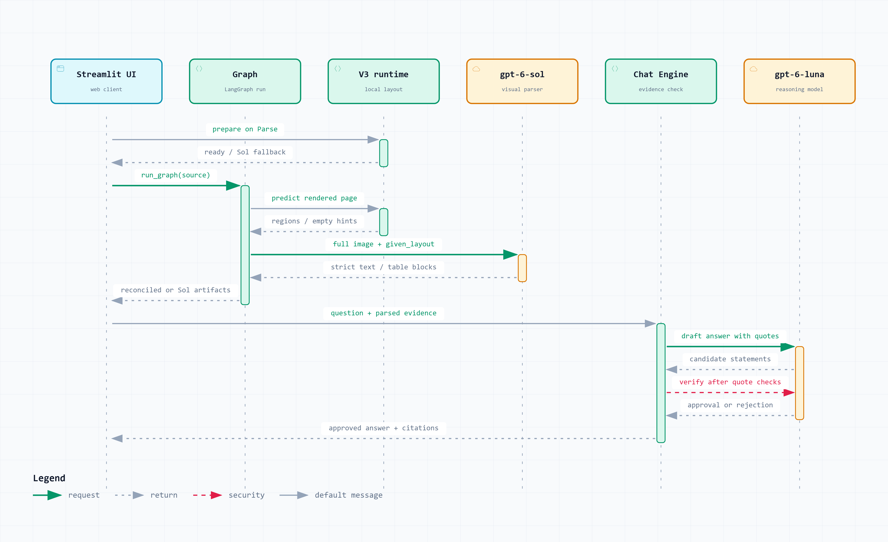

# GroundMark

GroundMark turns scanned PDFs and images into layout-aware Markdown using `gpt-6-sol`.

[GitHub repository](https://github.com/pypi-ahmad/GroundMark)

The model is asked to preserve the source text and layout, though transcription errors are still possible. GroundMark keeps page, block, and bounding-box data for reading order, annotations, and JSON output. It does not extract business fields, apply a domain schema, or correct values. Document chat answers questions and summarizes parsed pages.



[Explore the interactive architecture](docs/diagrams/groundmark-architecture.html).

## Install

GroundMark requires Python 3.14+. Install the GitHub release wheel with uv to use the app without cloning the repository:

```powershell
uv tool install --python 3.14 "https://github.com/pypi-ahmad/GroundMark/releases/download/v1.0.0/groundmark-1.0.0-py3-none-any.whl"
```

If `groundmark` is not on PATH, run `uv tool update-shell` and open a new terminal. [Install uv](https://docs.astral.sh/uv/getting-started/installation/) if needed.

You can also install the wheel in a Python 3.14+ virtual environment:

```powershell
# Using uv:
uv venv --python 3.14
uv pip install "https://github.com/pypi-ahmad/GroundMark/releases/download/v1.0.0/groundmark-1.0.0-py3-none-any.whl"
.\.venv\Scripts\groundmark.exe --help

# Or, inside an activated virtual environment, using pip:
pip install "https://github.com/pypi-ahmad/GroundMark/releases/download/v1.0.0/groundmark-1.0.0-py3-none-any.whl"
groundmark --help
```

Use the GitHub URL when installing. The package named `groundmark` on PyPI belongs to a different project.

### Configure your endpoint

Set your API key in PowerShell before starting the app:

```powershell
$env:OPENAI_API_KEY = "your-api-key"
# Optional, for a compatible endpoint:
$env:OPENAI_BASE_URL = "https://your-endpoint.example/v1"
```

You can put the variables in a `.env` file in the working folder or pass `--env-file path/to/settings.env`. Variables already present in the process take priority. If you set them as Windows User or Machine variables, open a new terminal before starting GroundMark so it inherits them.

Leave `OPENAI_BASE_URL` unset or blank to use the SDK default. Custom endpoints must use HTTPS; HTTP is accepted only for loopback addresses. Never commit your key. See [.env.example](.env.example) for optional resource limits.

The endpoint must support the app's models and structured visual parsing. Parsing uses `gpt-6-sol`; document chat uses `gpt-6-luna`. Setting a base URL does not change those model names.

### Web UI

```powershell
groundmark
# Optional workspace and port:
groundmark --workspace D:\Documents\GroundMark --port 5806
```

The default address is `http://127.0.0.1:5805`. The launcher reads `.env` from the workspace, which defaults to the current folder. UI uploads and results use a separate per-session temporary directory. `--headless` suppresses opening a browser. An occupied port produces a startup error.

### Extract from the terminal

```powershell
groundmark invoice.pdf output
groundmark invoice.pdf output --all
groundmark invoice.pdf output --markdown --html
groundmark invoice.pdf output --json --start-page 2 --end-page 5
```

Without a format flag, the command writes Markdown and any figure images it references. You can combine format flags; the selected pages are parsed once for all requested formats.

| Option | Output or behavior |
| --- | --- |
| `--markdown` | Markdown and figure images |
| `--html` | Self-contained HTML with embedded figures |
| `--json` | Full extraction, grounding, and page diagnostics |
| `--annotated-pdf` | PDF with block boxes |
| `--annotated-images` | Annotated page PNGs |
| `--markdown-zip` | ZIP containing the named Markdown file and figures |
| `--all` | All six formats |
| `--start-page N`, `--end-page N` | Inclusive page range; all pages by default |
| `--view full`, `--view clean` | Rendering view; `full` by default; JSON stays complete |
| `--detailed-layout` | Experimental structure extraction, off by default |
| `--env-file PATH` | Explicit configuration file |
| `--overwrite` | Allow saving a new run in a nonempty output directory |
| `--version`, `--help` | Version and usage |

Use a new or empty output directory unless you pass `--overwrite`. The input file must be outside it. CLI exports and GUI downloads use the original filename and extraction start time in UTC, such as `invoice_20260923_100045Z.md`. One basename covers every format and stays fixed when you switch between Clean and Full. If the name is taken, GroundMark adds fractional seconds. It replaces unsupported filename characters and shortens long stems. The source hash remains in the grounded JSON.

The command prints generated paths to stdout and progress and diagnostics to stderr. Exit codes are `0` for success, `1` for failure, `2` for invalid arguments or configuration, `3` for partial extraction or export problems, and `130` for interruption. Usable partial output stays in the output directory.

### Clone and run locally

```powershell
git clone https://github.com/pypi-ahmad/GroundMark.git
cd GroundMark
uv sync --extra layout
uv run --extra layout groundmark
# Or extract without opening the UI:
uv run --extra layout groundmark invoice.pdf output --all
```

Windows users can also run `run.cmd`, which forwards launcher arguments. For development, run `uv run python -m pytest tests`. The [Runbook](docs/RUNBOOK.md) covers artifacts, builds, upgrades, and troubleshooting.

GroundMark attempts local PP-DocLayoutV3 analysis before each Sol extraction request. The `layout` extra supplies the runtime dependencies; base imports and offline tests still work without them. First use downloads the pinned official model into the user cache unless an explicit local model directory is configured. Preparation tries CUDA inference, then verifies CPU fallback if needed. If neither works, or dependencies are absent, extraction continues with Sol blocks and records a safe layout-fallback diagnostic. See [runtime configuration and verification](docs/LAYOUT-V3.md).

In Streamlit, the first valid Parse click shows “Preparing PP-DocLayoutV3…” and then the actual GPU (CUDA) or CPU device. Uploads and previews do not load the model. Preparation failure shows a warning and continues with Sol; another Parse click retries V3. The process keeps one ready model across reruns and uploads. Tab/view changes do not rerun inference. The Detailed layout checkbox remains a separate, experimental Sol structure option.

CLI extraction prints readiness, reuse, timings, and each page's outcome to stderr. The UI's Layout summary shows match/review counts; JSON `layout_metadata` retains full evidence. Review counts can overlap accepted matches and do not measure accuracy. Configure `GROUNDMARK_LAYOUT_DEVICE=cpu` for explicit CPU use or leave `auto` for verified CUDA with CPU fallback. `GROUNDMARK_LAYOUT_MODEL_DIR` selects existing pinned files; otherwise the standard Hugging Face cache is used. Restart the process after configuration changes.

## Outputs

- Input preview shows the selected source pages before processing.
- Markdown has rendered and raw views, plus copy and download controls.
- Annotated shows grounded block overlays and provides a PDF download.
- HTML shows the self-contained rendered output and provides a download.
- JSON shows the internal layout data with copy and download controls.
- Chat answers document questions with `gpt-6-luna` at medium reasoning, using short responses and inline page references.

UI artifacts use a per-session temporary directory, cleaned when the upload is replaced or removed. Browser disconnects do not guarantee immediate cleanup or request cancellation; see the [runbook](docs/RUNBOOK.md). CLI extraction writes selected artifacts to the supplied output directory.

Markdown and HTML open in Clean view. Full also shows running headers and footers when the model has classified them. Both views keep unclassified content. JSON and chat include all extracted content from successful pages, while annotations show blocks with valid boxes. Tables without identified headers keep their first row as data. Figures with valid boxes appear as crops in the previews and HTML. **Download Markdown with images** packages the Markdown and crops in a ZIP.

Detailed layout (experimental) adds heading levels, nested lists, checkbox states, merged cells, and page-header/footer roles. It is off by default. In a five-page comparison before V3 integration, mean word-token F1 rose from 95.67% to 95.99%, but source review found new transcription errors. Those results do not measure the V3 path. See [Layout evaluation](docs/LAYOUT-EVALUATION.md) for the results and limits.

## How it works

LangGraph runs a fixed preprocess, parse, and finish sequence. It has no automatic extraction review or correction loop. The default prompt and response contract do not classify running headers or footers, so Clean and Full show the same blocks in default-mode results. Switching views makes no model calls and cannot recover structure the parser did not capture.

Saved JSON records `schema_version: 2`, the extraction profile, and separately validated `layout_metadata` with V3 regions, provenance, and reconciliation evidence. Older JSON without that field still loads. Neither strict Sol response schema includes it. The GUI graph saves the full Markdown and HTML; UI downloads use the selected view. CLI exports use the view chosen with `--view`.

GroundMark renders selected pages with the existing 200-DPI/1,600-pixel profile. V3 analyzes the same page image sent to `gpt-6-sol`, and both parsing prompts receive bounded region hints. The image remains the transcription source. After strict response validation, conservative one-to-one reconciliation applies accepted V3 boxes and order without changing Sol text, tables, or structure. Unmatched and ambiguous blocks stay intact. All exports, figure crops, annotations, and chat evidence use the reconciled pages. Polygon contours remain metadata; overlays and crops use rectangles.

Pages run in source order. Each Sol request can include up to 12,000 characters from earlier successful pages. Initialization failure uses Sol-only extraction for the selected run; a later V3 failure uses Sol blocks for that page. Successful pages remain usable as partial output. Missed, weak, ambiguous, split/merge, or role/label-mismatched regions retain Sol blocks and boxes. Matching thresholds are initial, uncalibrated rules, not measured accuracy claims.

The parse-first approach is described by [LlamaParse](https://developers.llamaindex.ai/llamaparse/parse/getting_started/). [LandingAI ADE](https://docs.landing.ai/ade/ade-parse-visualize-sample) shows a similar Markdown and annotation workflow. The [GPT-6 Sol page](https://developers.openai.com/api/docs/models/gpt-6-sol) covers the model's capabilities and pricing.

Supported inputs are PDF, PNG, JPEG, TIFF, and WebP. Parsing accepts only `gpt-6-sol`; chat uses only `gpt-6-luna`.

Chat reads successfully parsed pages from the current run. It does not read the original files or failed pages. Before showing an answer, the app checks quoted excerpts against the parsed text and makes a separate verification call. Chat refuses unrelated requests and has no tools or browsing. These controls reduce prompt-injection risk, though they cannot prevent every attack. History stays in the browser session and resets when the document, page range, extraction mode, or parse run changes.

For development, install the test dependency and run the suite through uv:

```powershell
uv sync
uv run python -m pytest tests
```

The suite uses fake layout runtimes and fake model responses; it needs neither weights nor paid calls. Use `uv run --extra layout` to include V3 after a base-only sync. Without the extra, extraction uses the documented Sol fallback.

## Diagrams

The diagrams show parsing, artifact flow, run outcomes, and document chat. Each image links to an interactive version.

<details>
<summary>Document parsing workflow</summary>



[Explore the workflow](docs/diagrams/groundmark-workflow.html).
</details>

<details>
<summary>Document extraction data flow</summary>



[Explore the data flow](docs/diagrams/groundmark-dataflow.html).
</details>

<details>
<summary>Document execution lifecycle</summary>



[Explore the lifecycle](docs/diagrams/groundmark-lifecycle.html).
</details>

<details>
<summary>Parse and chat sequence</summary>



[Explore the sequence](docs/diagrams/groundmark-sequence.html).
</details>

The editable JSON and visual-check captures are in [docs/diagrams](docs/diagrams/).

## Documentation

- Use and development: [Runbook](docs/RUNBOOK.md), [Architecture](docs/ARCHITECTURE.md), [Python API](docs/PYTHON-API.md), [Model](docs/MODEL.md), [V3 runtime and matching](docs/LAYOUT-V3.md), [Prompt contract](docs/PROMPTS.md), [Data and output boundaries](docs/COMPLIANCE.md), [Contributing](docs/CONTRIBUTING.md).
- Recorded evaluations: [Layout](docs/LAYOUT-EVALUATION.md), [Sol resolution](docs/SOL-RESOLUTION-EVALUATION.md), [Earlier prompts](docs/PROMPT-EVALUATION.md), [Content-filter diagnostics](docs/CONTENT-FILTER-DIAGNOSTICS.md). These reports record the methods and results from each run.

## License

[MIT](LICENSE).
